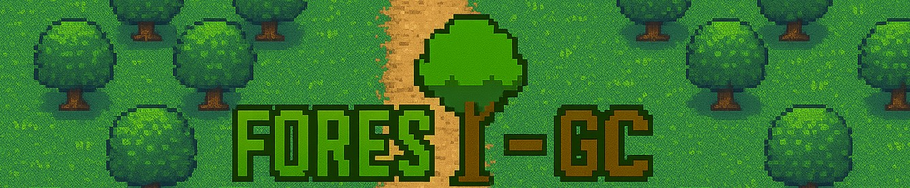

<p align="center">
  
</p>

# FOREST-GC: A con**FO**rmable **R**endering **E**ngine for **S**ynthetic **T**ree **G**eneration and **C**ounting
**Authors:**  *Luciano Prono*<sup>1</sup>, *Najmeddine Dhieb*<sup>2</sup>, *Philippe Bich*<sup>1</sup>, *Chiara Boretti*<sup>1</sup>, *Fabio Pareschi*<sup>1</sup>, *Hakim Ghazzai*<sup>2</sup>, and *Gianluca Setti*<sup>2</sup>

<sup>1</sup> Politecnico di Torino, Italy  
<sup>2</sup> King Abdullah University of Science and Technology (KAUST), Saudi Arabia

[](LICENSE)

This is the Official GitHub repository of **FOREST-GC**: a configurable, GPU-accelerated rendering engine to generate **high-resolution synthetic satellite imagery** of tree plantations, primarily olive trees. It includes precise annotations of tree positions and counts, enabling training and evaluation of deep learning models for **automated tree counting from satellite data**.

This project addresses the critical challenge of limited labeled datasets for agricultural monitoring by enabling **sim-to-real transfer learning** for precise tree counting.

---

## ✨ Features

- Generates **realistic RGB+NIR satellite images** with over 100 configurable parameters.
- Emulates diverse terrain textures, tree distributions, and shadows.
- Supports training of object detection and segmentation models (e.g., YOLO, SAM).
- Provides annotations for supervised learning.
- Python + PyTorch implementation optimized for GPUs.

<p align="center">
  
</p>

## 🚀 Installation and usage

Clone the repository:

```bash
git clone https://github.com/SSIGPRO/albero-system.git
cd albero-system/field_generator
```
In order to launch the image generator, use

    python main.py

The configurations of the generator can be found in `main.py`

The output of the generator is saved in `./outputs`

## 🌿 Evaluation on Real Data with Synthetic Training

This section presents the predictions of **YOLO** and **SAM** models trained exclusively on synthetic tree data. The results demonstrate how well these models generalize to real forest imagery.

**YOLO Predictions:**  
The YOLO model detects trees accurately in real images:


**SAM Predictions:**  
The SAM model produces high-quality segmentation masks:


## 📈 Citation

If you use this code or dataset, please cite the associated paper:

```
@article{prono2025forestgc,
  title={FOREST-GC: A conFOrmable Rendering Engine for Synthetic Tree Generation and Counting},
  author={Luciano Prono and Najmeddine Dhieb and Philippe Bich and Chiara Boretti and Fabio Pareschi and Hakim Ghazzai and Gianluca Setti},
  journal={preprint},
  year={2025},
}
```

---

## 🤝 Acknowledgments

This work is part of the project NODES which has receive was fundings from the MUR - M4C2 1.5 of PNRR funded by the European Union - NextGenerationEU (Grant agreement no. ECS00000036).

---

## 📬 Contact

For questions or collaborations, please contact:
[Luciano Prono](mailto:luciano.prono@polito.it)
